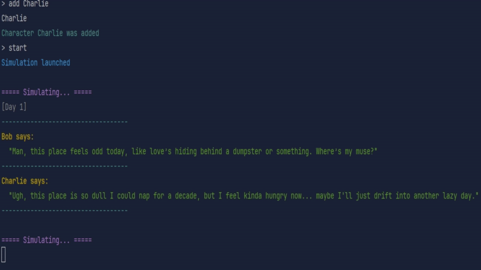

# 🧠 Flat World: AI-Powered Reality Show Simulator

<p align="center">
  
</p>

A quirky, chaotic reality show where fully simulated characters powered by GPT live, talk, fight, joke, and evolve — all without scripts.

Each character has emotions, needs, relationships, and a personality. They interact with each other, react to daily events, and generate raw, unscripted dialogue. Anything can happen.

<p align="center">
  
</p>

---

## How It Works

- Every character has internal state (mood, hunger, energy, etc.) and a personality.
- On each simulation tick, characters:
    - React to others' dialogue.
    - Speak naturally with slang, humor, or dark vibes.
    - Update their stats and relationships.
- GPT is used to simulate thoughts and generate responses.
- Spontaneous events may occur (romance, fights, existential crises... who knows?).

---

## 🛠 Setup

### 1. Clone the repository

```bash

Create .env file in the root
Add your OpenAI API key to a .env file in the root:

OPENAI_API_KEY=your-key-here
You must have a valid OpenAI API key with GPT-4.1o-mini access.
```

Run the simulation

go run ./cmd

Once started, you'll see each character speak and evolve every 30 seconds.

## Features
AI-based character behavior with memory and emotional state

Dynamic relationships and social logic

Randomized setting: modern, fantasy, sci-fi, etc.

Sarcasm, profanity, awkward flirting, and comedy, etc — it's all in the scriptless chaos

# 📬 Contribute / Ideas
Open issues or create PRs